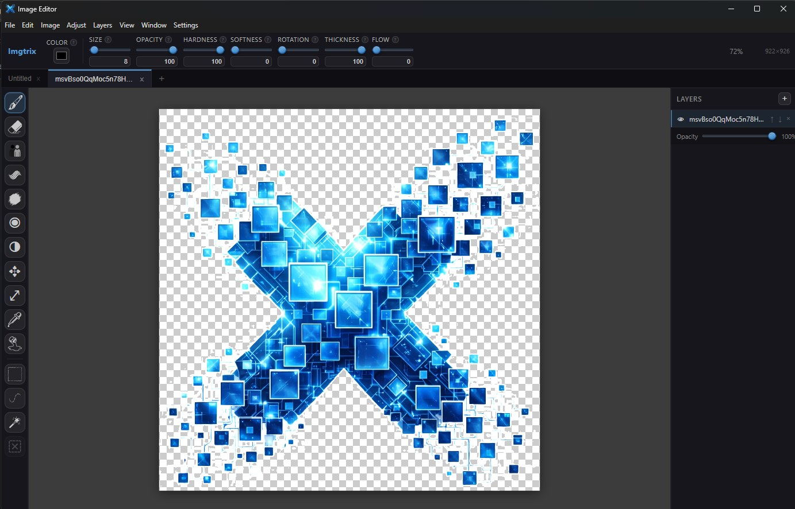

# imgtrix

A desktop image editor built with Electron and Svelte. Designed as a solid foundation for advanced image editing features — multi-layer canvas editing, a growing brush toolset, non-destructive history, and a native application experience.



---

## Features

- **Multi-tab editing** — Work on multiple images simultaneously, each with independent layers, history, and viewport state
- **Layer system** — Add, remove, reorder, and toggle visibility of layers with 12 blend modes and per-layer opacity
- **GPU-accelerated compositing** — WebGL renderer composites all visible layers and blend modes in a single shader pass; 3–10× faster than the CPU fallback on multi-layer documents
- **Brush tools** — Pencil, Eraser, Clone Stamp, Warp (push / twirl / bloat / pucker / reconstruct), Blend/Smudge, Saturation, and Dodge/Burn — all pressure-sensitive for drawing tablets
- **Selection tools** — Rectangular marquee, freehand lasso, and magic wand (color tolerance) with marching-ants preview
- **Utility tools** — Eyedropper (color pick), Fill (paint bucket), Move Selection contents, Move Layer
- **Edit operations** — Copy, cut, paste (to new layer), select all, clear selection
- **Selection to new image** — Extract a selection into its own tab, sized to the selection bounds
- **Memory-efficient undo / redo** — Per-tab history stores only the affected dirty rect (10–100× smaller than full-canvas snapshots), with a 512 MB budget per tab and automatic eviction of the oldest entries
- **File support** — Native `.img` project format (ZIP-based, preserves all layers), plus PNG / JPEG / WebP import and export
- **Import options** — Import as a new layer on the current canvas, or import as a new tab sized to the image
- **Canvas operations** — Resize canvas, rotate 90° / 180°
- **Customizable hotkeys** — All tools and menu actions can be rebound from the Settings panel
- **Dirty state tracking** — Unsaved-changes indicator per tab, with save prompts on close
- **Auto-update** — Built-in update channel via GitHub releases (Windows + Linux supported today; macOS coming later)

---

## Architecture

```
imgtrix/
├── electron/
│   ├── main.ts             # Main process: window creation, native menus, IPC handlers, file dialogs
│   ├── preload.ts          # Preload bridge: exposes window.api.* to the renderer safely
│   └── settings-manager.ts # Persists user settings (hotkeys, preferences) to disk
│
├── src/
│   ├── App.svelte           # Root component: toolbar, tab bar, tool sidebar, all menu action handlers
│   ├── store.ts             # Svelte stores: tab state, active tool, selection, clipboard, history
│   ├── settings-store.ts    # User preferences and hotkey bindings
│   │
│   ├── components/
│   │   ├── CanvasView.svelte   # Canvas rendering loop, pointer event handling, undo/redo application
│   │   ├── LayerPanel.svelte   # Layer list UI: add/remove/reorder/visibility/opacity/blend mode
│   │   └── Tooltip.svelte      # Floating tooltip component used in the toolbar
│   │
│   ├── constants/
│   │   ├── hotkeys.ts            # Default keyboard shortcuts for tools and menu actions
│   │   ├── tool-meta.ts          # Tool metadata (icon, label, parameter schema)
│   │   ├── settings_defaults.ts  # Default values for user-configurable settings
│   │   ├── ui-strings.ts         # Centralized UI copy
│   │   └── param-strings.ts      # Tool parameter labels and tooltips
│   │
│   ├── workers/
│   │   └── brush-worker.ts     # Background brush stroke computation (off the main thread)
│   │
│   └── engine/
│       ├── compositor.ts        # CPU (Canvas2D) compositor — fallback path
│       ├── webgl-compositor.ts  # GPU compositor: all 12 blend modes in a single fragment shader
│       ├── history-manager.ts   # Undo/redo stack with dirty-rect snapshots and a 512 MB per-tab budget
│       ├── layer.ts             # Layer class wrapping an OffscreenCanvas, with a gpuDirty flag
│       ├── layer-stack.ts       # Ordered collection of layers with active index, resize, rotate
│       ├── file-manager.ts      # Save/open .img projects (JSZip), import/export images
│       ├── selection.ts         # Selection type definitions (rect | lasso | magic wand)
│       ├── warp-webgl.ts        # GPU bilinear resampling for the warp tool
│       ├── tool-manager.ts      # Dispatches pointer events to the active tool, owns stroke overlay canvas
│       └── tools/
│           ├── tool.ts          # Tool interface and HistoryEntry type
│           ├── brush-params.ts  # Shared pressure-sensitive dab drawing used by paint tools
│           ├── pencil.ts        # Pressure-sensitive paint brush
│           ├── eraser.ts        # Eraser brush
│           ├── clone.ts         # Clone stamp with optional trace mode
│           ├── warp.ts          # Liquify-style warp (push, twirl, bloat, pucker, reconstruct)
│           ├── blend.ts         # Smudge/blend brush
│           ├── saturation.ts    # Saturate / desaturate brush
│           ├── dodge-burn.ts    # Dodge (lighten) / burn (darken) brush
│           ├── fill.ts          # Flood-fill / paint bucket
│           ├── eyedropper.ts    # Color picker
│           ├── rect-select.ts   # Rectangular marquee selection
│           ├── lasso-select.ts  # Freehand lasso selection
│           ├── magic-wand.ts    # Color-tolerance selection
│           ├── move.ts          # Move selected pixels
│           └── move-layer.ts    # Move the active layer
```

### Key design decisions

**Electron + Svelte via electron-vite** — The main process handles native concerns (menus, file dialogs, window lifecycle). The renderer is a standard Svelte SPA communicating with main exclusively through the `window.api` preload bridge.

**OffscreenCanvas per layer with a `gpuDirty` flag** — Each layer owns an `OffscreenCanvas`. Tools read and write pixel data directly via `getImageData` / `putImageData`. When a layer's pixels change, its `gpuDirty` flag is set; the WebGL compositor re-uploads only those layers to GPU textures on the next frame, avoiding redundant uploads for static content.

**Single-pass WebGL compositing** — `webgl-compositor.ts` composites the entire layer stack in one draw call: a single fragment shader handles all 12 blend modes via a uniform per layer. The CPU `compositor.ts` is kept as a fallback for environments without WebGL.

**Store-swapped tab state** — Tab switching works by saving the current tab's state (viewport, selection, zoom) back into the tab object, then loading the new tab's `LayerStack` and `HistoryManager` into the shared Svelte stores. Components subscribe to the stores and automatically reflect whichever tab is active. The compositor and tool manager are singletons and are never swapped.

**Dirty-rect history** — Each `HistoryEntry` stores before/after pixel buffers for only the affected rect, not the full canvas — typically 10–100× smaller. A 512 MB per-tab budget evicts the oldest entries automatically, so memory stays bounded even on long editing sessions with large canvases.

**Dynamic native menu** — Menu items that depend on application state (Copy, Cut, Paste, Clear Selection, Move Selection to New Image) are enabled/disabled by rebuilding the Electron menu via `Menu.setApplicationMenu`. The renderer notifies the main process of selection and clipboard state changes over IPC.

---

## Local Development

### Prerequisites

- [Node.js](https://nodejs.org/) v18 or later
- npm v9 or later

### Install dependencies

```bash
npm install
```

### Start the development server

```bash
npm run dev
```

This starts the Electron app with Vite's HMR dev server. Changes to `src/` (Svelte/TS renderer code) hot-reload instantly. Changes to `electron/` (main process) require an app restart.

### Build for production

```bash
npm run build
```

Output is written to `out/`. The app can be previewed from the build with:

```bash
npm run preview
```

### Project file format (`.img`)

The native project format is a ZIP archive containing:
- `manifest.json` — canvas dimensions and metadata
- `layers.json` — layer metadata (name, blend mode, opacity, visibility)
- `layers/<id>.bin` — raw RGBA pixel data for each layer

This format is handled entirely by `src/engine/file-manager.ts`.
